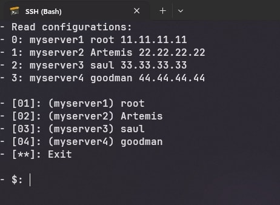

## SSH v3

Это простой скрипт, который упрощает процесс подключения к удаленным машинам через SSH. Он читает данные из cfg файла и создает удобное меню для выбора. После выбора скрипт выполняет команду SSH для подключения.



ssh.v3.cfg:

```
hostname user ip
myserver root 11.11.11.11
support multiple machines
```

В `hostname` можно вписать что угодно, это просто название. `user` и `ip` актуальные данные удаленной машины. Все данные должны быть без пробелов.
